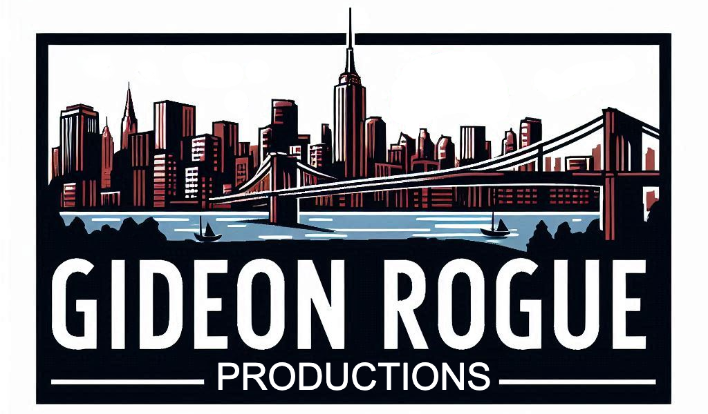
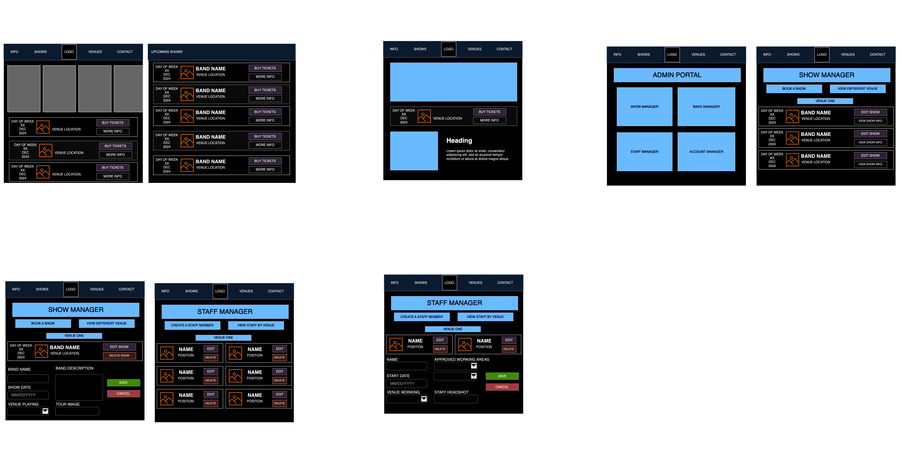

# Gideon-Rogue-Productions

Welcome to **Gideon Rogue Productions** — a premier venue production company managing multiple venues across the city. We specialize in organizing and hosting events, bringing top-tier bands and artists to our stages, and ensuring smooth operations at every event. 

This README provides an overview of how we manage our venues, staff, and events. Below, you’ll find details about our system setup, database schema, and website wireframe.

## System Overview

At Gideon Rogue Productions, we leverage a custom-built system that manages key aspects of our venue operations, including:

- **Venues**: Information on all the venues we manage, including location, capacity, and event scheduling.
- **Staff**: Our team members and their roles in each venue.
- **Bands & Artists**: The bands and artists performing at our venues, their schedules, and ticketing information.
- **Event Management**: Handling ticket sales, show details, and other logistical items.

## Database Schema

Our system is powered by a robust relational database, and the ERD (Entity Relationship Diagram) above illustrates the connections between various tables used in our system. Key relationships include:

- **Venues** to **Shows** and **Bands**: Venues are associated with events that feature specific bands and artists.
- **Tickets** and **Attendees**: Information about ticket sales, including user data and ticket status.
- **Staff Assignments**: Employees are assigned to various tasks at each venue, ensuring smooth event operations.

## Website Wireframe

Here is a wireframe that outlines the layout of our website. It consists of two key sections:

1. **Customer-facing Website**:
   - A modern, clean design allowing customers to browse upcoming events, view details, and purchase tickets.
   - Includes a filter dropdown for sorting events by date, genre, and venue.
   - Each event shows an image, the show title, venue name, event date and time, ticket info, and a call-to-action button for buying tickets or viewing more details.

2. **Admin Dashboard**:
   - A backend interface where our staff can manage venue information, shows, ticket sales, and artist bookings.
   - Admins can update event details, assign staff to shifts, and generate reports for the shows.

## Features

- **Event Management**: Add, edit, and schedule events for different venues.
- **Ticketing System**: Integration with a ticketing platform to handle sales and provide event access.
- **User Management**: Admin tools for managing staff and their roles.
- **Responsive Design**: The site adjusts for desktop and mobile users for both customer-facing pages and admin dashboards.